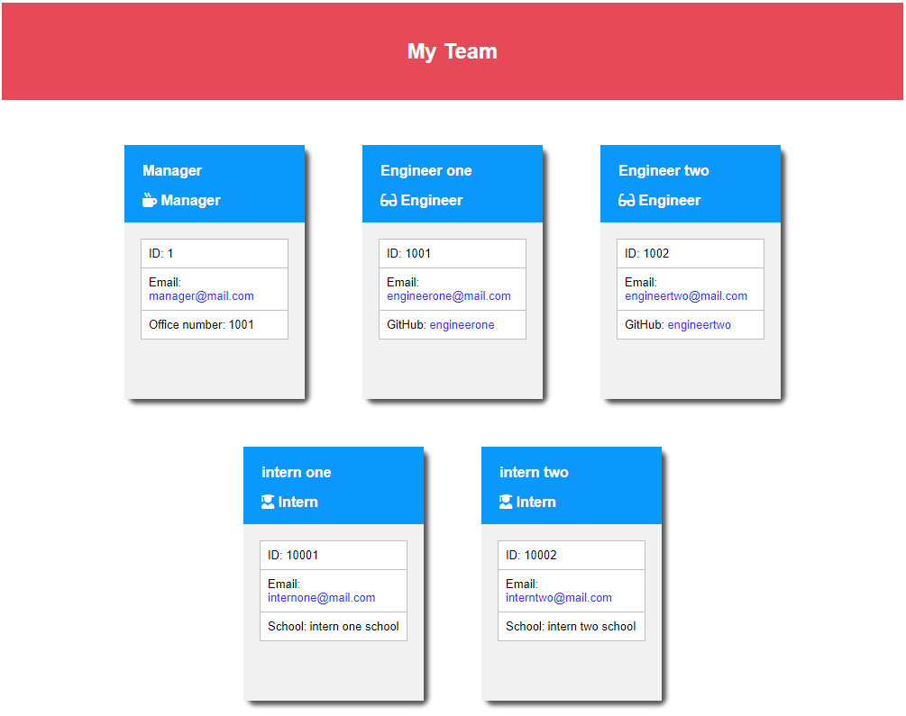

# TeamProfileGenerator
Team Profile Generator is a node application to generate an html file with team members infomation. The team consists of a manager, engineers and interns.

Application will ask for name, email address and other information like phone number

## User Story
```
As a manager
I want to generate a webpage that displays my team's basic info
so that I have quick access to emails and GitHub profiles
```
A command-line application that dynamically generates Team profile from uer input. The application will be invoked with the following command:

```
lib/           // classes and helper code
output/        // rendered output
templates/     // HTML template(s)
test/          // jest tests
app.js         // Runs the application
```


### User input

The project must prompt the user to build an engineering team. An engineering
team consists of a manager, and any number of engineers and interns.


-  Github
> https://github.com/pplainx/TeamProfileGenerator


 ## This application includes the follows


This application funs as follows

Run command ```node app.js```
    This will request for user inputs and generate a file in output folder as
    *  {team.html}
    
